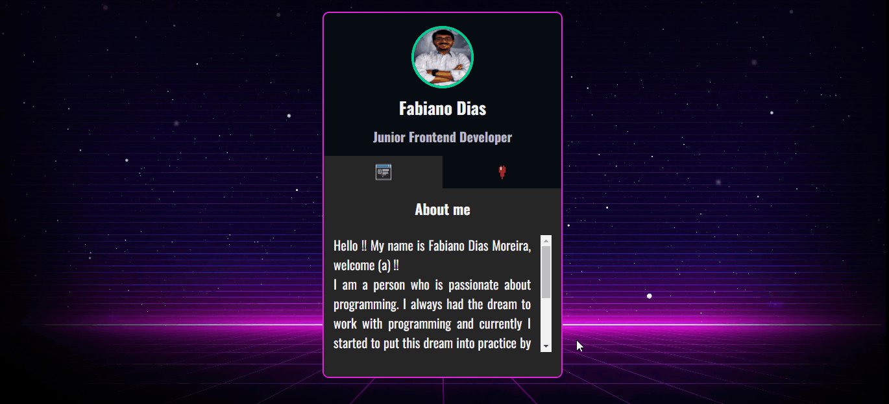

# Projeto - Card
Um projeto que visou demonstrar a criação de um mini portfólio com intenção de informar as pessoas sobre mim, as tecnologias que estudo
nesta modalidade frontend e também alguns hábitos de vida que tenho. Design, desenvolvimento de códigos e toda estrutura de maneira fácil e compreensiva. Com um click nos ícones do card é possível acessar as informações pessoais tanto quanto as minhas redes sociais.🚀❤🙌

[]

## Tecnologias utilizadas 🚀
- HTML5
- CSS3
- JAVASCRIPT
- PHOTOSHOP

## Por que desenvolvi o projeto ?

Este trabalho foi desenvolvido com intuito de demonstrar minhas habilidades com a programação por meio da elaboração de mini portfólio. O projeto mostra algumas informações pessoais, as teconologias que tenho estudado nesta modalidade de desenvolvimento frontend tanto quanto, acionando o outro ícone, mostra as minhas redes sociais. Todo design foi desenvolvido por mim com axílio da ferramenta photoshop. Espero que curtam e ajude compartilhando !!!

Feito com ❤ por Fabiano Dias Moreira 👏 [Veja meu linkedIn](https://www.linkedin.com/in/fabiano-dias-moreira-b851b7217/)